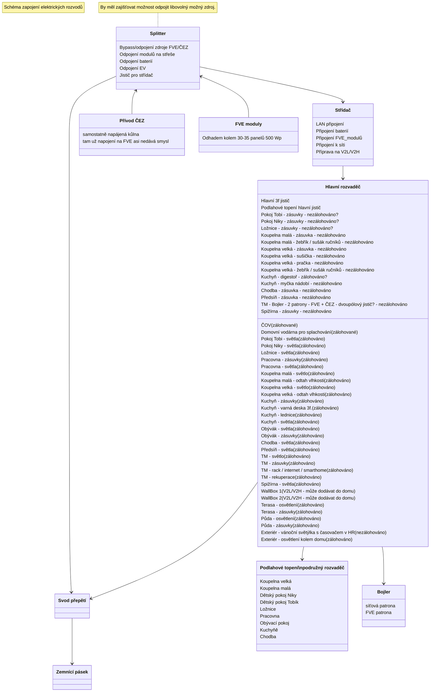
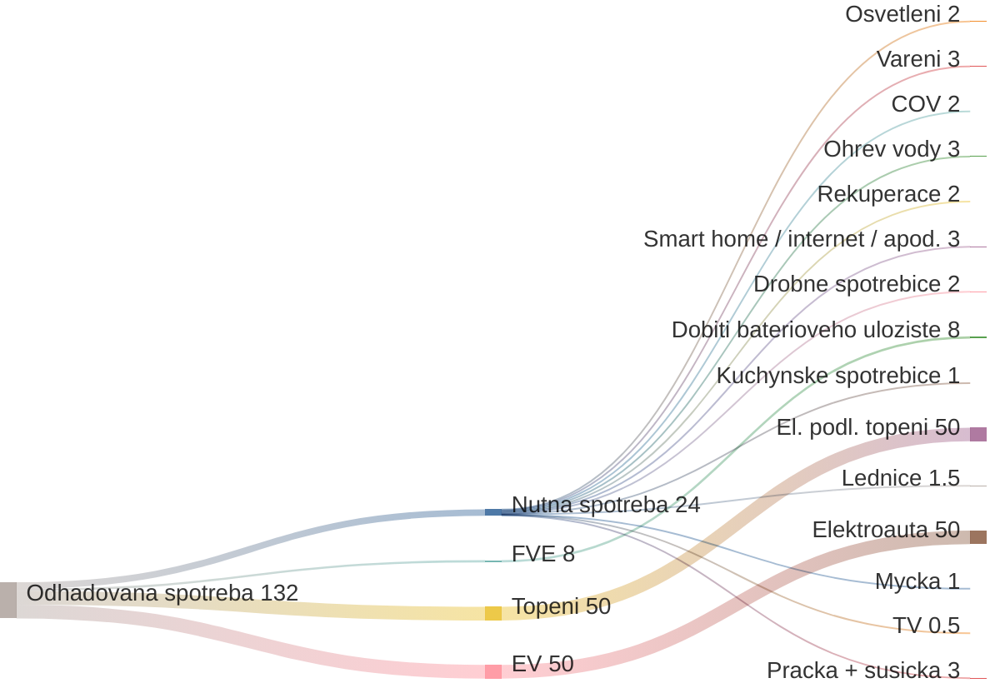

# Zapojení Elektřiny

## Požadavky:

- FVE a ČEZ je možné úplně oddělit (v případě poruchy zdroje X přepnout pouze na zdroj Y - bypass zdroje X)
- FVE funguje v hybridním 3f. režimu (může dodávat do sítě, ale nechceme)
- FVE může:
  - nahřívat bojler
  - dobíjet baterie (jde i ze sítě - dle spotu a výhodnosti - Loxone?)
  - dobíjet EV (jde i ze sítě - dle spotu a výhodnosti - Loxone?)
  - provozovat většinu domácnosti (primárně všechno asi krom podlahového vytápění)
- Bateriový systém + EV powerbanka (V2L a V2H)
  - napájí chod domácnosti (omezený rozsah)
    - světla
    - vybrané označené zásuvky
    - smart home / servery / internet
    - lednice
    - Domovní vodárna pro splachování
    - varná deska?
    - rekuperace?
    - ČOV?
  - vypomáhá baterie přes den FVE s vykrytím špiček na fázi (asymetrie střídače, nebo bude brát ze sítě, protože to střídač nedokáže obsloužit)?
  - může v budoucnu dodávat do sítě (není nutné, ani nevím zda žádané)
- Světla
  - rozmyslet, zda se spínají pomocí relé v TM a vypínače jsou pouze tlačítka s UTP/FTP, nebo vypínače na stěně.
  - LEDky třeba na 24V? Nemusely by jít přes střídač z baterií.
- Rekuperace
  - by měla být zálohována pro případ, že vypadne proud v zimě, tak může rozvádět teplo od kamen (jediný jiný zdroj tepla než elektrický)

## TZB:
- kamerový systém (vlastní na Synology)
- bezpečnostní systém (alarm, okna, má to vůbec smysl)?
- protipožární systém?
- moisture guard ve stěnách?

## Zapojení rozvodů, návrh

## Odhadovaný výkon FVE
- [Kalkulačka výkonu FVE](https://re.jrc.ec.europa.eu/pvg_tools/en/)
- Očekávaný příjem FVE (denní) v **letních měsících: 60 kW**.
- Očekávaný příjem FVE (denní) v **jarních/podzimních měsících: 30 kW**.
- Očekávaný příjem FVE (denní) v **zimních měsících: 15 kW**.

### Graf výroby FVE podle měsíců ve Smrčí při sklonu střechy 40° a otočení na jih.

## Odhadovaná spotřeba domu (denní, kW)

Z grafu je vidět, že 15 kWp od jara do podzimu bez problémů zvládá kompletní chod domácnosti s přebytkem i včetně nabíjení bateriového úložiště.

Zbývá i něco málo pro dobíjení elektroaut (pokud někdy budou).

Zimu je potřeba hodně dotovat ze sítě, hlavně kvůli topení. Běžný chod domácnosti by se z velké části dal vykrýt i v zimě.