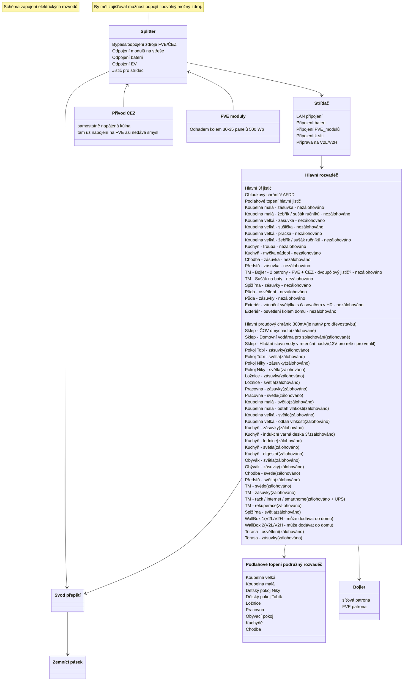
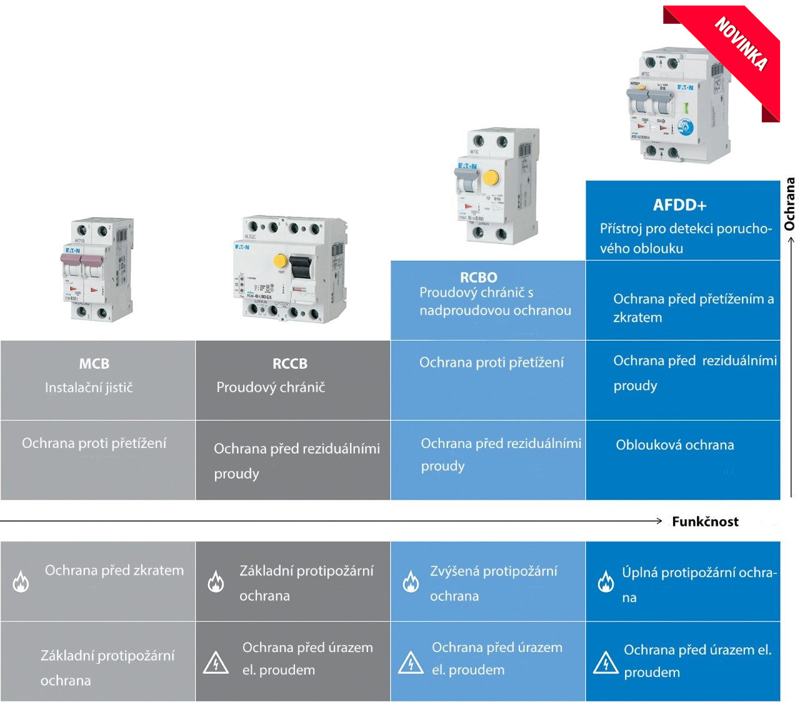
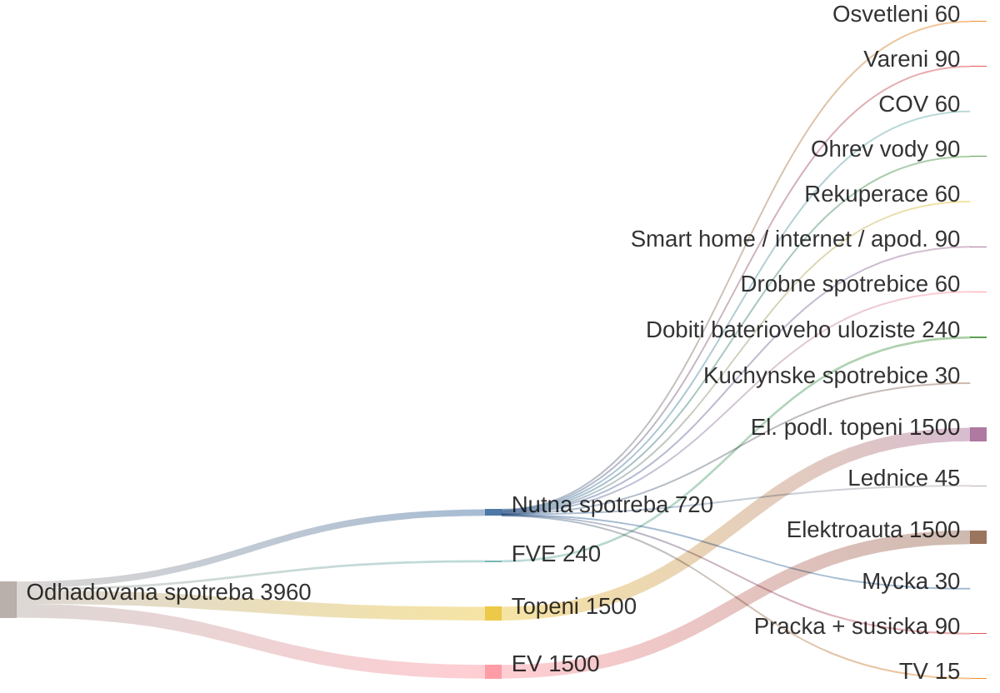

# Zapojení Elektřiny

## Požadavky:

- FVE a ČEZ je možné úplně oddělit (v případě poruchy zdroje X přepnout pouze na zdroj Y - bypass zdroje X)
- FVE funguje v hybridním 3f. režimu (může dodávat do sítě, ale nechceme)
- FVE může:
  - nahřívat bojler
  - dobíjet baterie (jde i ze sítě - dle spotu a výhodnosti - Loxone?)
  - dobíjet EV (jde i ze sítě - dle spotu a výhodnosti - Loxone?)
  - provozovat většinu domácnosti (primárně všechno asi krom podlahového vytápění)
  - optimalizuje kam posílá přebytky co se aktuálně nespotřebovávají (chod domácnosti > baterie > bojler > EV) např pomocí [WATTrouteru](./SmartHome.md)
- Bateriový systém + EV powerbanka (V2L a V2H)
  - napájí chod domácnosti (omezený rozsah)
    - světla
    - vybrané označené zásuvky
    - smart home / servery / internet
    - lednice
    - Domovní vodárna pro splachování
    - varná deska?
    - rekuperace?
    - ČOV?
  - vypomáhá baterie přes den FVE s vykrytím špiček na fázi (asymetrie střídače, nebo bude brát ze sítě, protože to střídač nedokáže obsloužit)?
  - může v budoucnu dodávat do sítě (není nutné, ani nevím zda žádané)
- Světla
  - rozmyslet, zda se spínají pomocí relé v TM a vypínače jsou pouze tlačítka s UTP/FTP, nebo vypínače na stěně.
  - světla tahat ideálně CYKY 5x1.5mm pro možnost dvou okruhů v jednom místě?
  - LEDky třeba na 24V? Nemusely by jít přes střídač z baterií.
- Rekuperace
  - by měla být zálohována pro případ, že vypadne proud v zimě, tak může rozvádět teplo od kamen (jediný jiný zdroj tepla než elektrický)

## TZB:

- kamerový systém (vlastní na Synology)
- bezpečnostní systém (alarm, okna, má to vůbec smysl)?
- protipožární systém? [Aliexpress bundle Zigbee](https://www.aliexpress.com/item/1005007907100604.html?spm=oneshop.home.fastdelivery.2.701f7f6bY3M8ns&skuId=12000042795362283&pdp_ext_f=%7B%22sku_id%22%3A%2212000042795362283%22%7D&aecmd=true) a asi o dost lepší [AQARA Smoke Detector (SD-S01D)](https://www.alza.cz/aqara-smoke-detector-sd-s01d-zigbee-3-0-d12689506.htm)
- moisture guard ve stěnách?
- [SmartHome](./SmartHome.md)

## Zapojení rozvodů, návrh

- rozdíly mezi [obloukovou ochranou, chráničem, jističem](https://www.ielektra.cz/rsc4847441-jak-se-lisi-jistic-proudovy-chranic-a-obloukova-ochrana).

## FVE

Střecha bude pokrytá FV moduly z

- východní strany (+- 17 modulů od jihu po komín od krbu),
- západní strany (+- 18 modulů od jihu po komínky s větráním/odtahem kanalizace),
- jižní strany (+- 8 panelů) na rizalitu

Celkem tedy něco kolem 44 ks modulů.

Vychází mi maximální rozměr modulu +- 2100×1200 aby se vešly ve 3 řadách na střechu a ve 2 na rizalit.

Celkový výkon FVE je mezi 15-25 kWp, ale reálně bude pod polovinou (osvit pouze z východu nebo západu).

### Požadavky na FVE

- Moduly kolem 500 Wp ([DAH Solar 550Wp](https://www.i4wifi.cz/cs/300859-dah-solar-dhm-t72x10-fs-bw-550w-cerny-ram-63v-1-3-cut-bezramove-provedeni) - pokud se vejde na střechu!, [Elerix 525Wp](https://www.i4wifi.cz/cs/300816-elerix-esm-525t-paleta-36-ks))
- Každý by měl mít regulátor/optimizér (nebo alespoň ty na kritických místech, které mohou být stíněny - hřeben strěchy, komíny, sousední dům), nebo použít half-cut se 3 diodami bez optimizérů 🤷‍♂️?
- Half/triple cut cell panely!
- Střídač alespoň 15 kW (ideálně 20)
  - [Solax X3-Hybrid G4](https://www.solaxpower.com/products/x3-hybrid-g4/) - prý hodně odchází / reklamace
  - [Deye SUN-15K-G05](https://deye.com/cs/product/sun-15k-g05/)
  - [Deye SUN-18K-G05](https://deye.com/cs/product/sun-18-20-22-23-25k-g05/)
  - [Huawei SUN5000-17](https://solar.huawei.com/cz/professionals/all-products/SUN5000-Series/SUN5000-17-25K-MB0-specs)
- Střídač má asymetrii (ideálně co největší pro zabránění přetoků do sítě a využití solárů při záteži jedné fáze)
- Vyřešit křížení s hromosvodem!
- Příprava na možnost rozšířit FVE o zbytek západní/východní strany střechy o další moduly.
- Ideálně 3 stringy u střídače (jih/východ/západ)? Dává to smysl, nebo budou stačit 2 + optimizéry?
- Příprava na bateriové úložiště min. 10kW v TM nebo sklepě.

### Odhadovaný výkon FVE

- [Kalkulačka výkonu FVE](https://re.jrc.ec.europa.eu/pvg_tools/en/)
- Očekávaný příjem FVE (měsíční) v **letních měsících: 1800 kW**.
- Očekávaný příjem FVE (měsíční) v **jarních/podzimních měsících: 900 kW**.
- Očekávaný příjem FVE (měsíční) v **zimních měsících: 450 kW**.

### OpenSolar

- [první nástřel FVE a výkonu / spotřeby](./fve/2025-02-17_opensolar.pdf)

### Graf výroby FVE podle měsíců ve Smrčí při sklonu střechy 40° a otočení na jih.

## Odhadovaná spotřeba domu (měsíční, kWh)

Z grafu je vidět, že 15 kWp (450 až 1800kWh) od jara do podzimu bez problémů zvládá kompletní chod domácnosti s přebytkem i včetně nabíjení bateriového úložiště (únor až říjen).

Zbývá i něco málo pro dobíjení elektroaut (pokud někdy budou).

Zimu je potřeba hodně dotovat ze sítě, hlavně kvůli topení. Běžný chod domácnosti by se z velké části dal vykrýt i v zimě.

## Komponenty

- Rozvaděč
  - Silnoproud [cubico-ip40-1800x600x400mm](https://www.schrack.cz/eshop/skrine-pro-rozvadece-a-rozvodnice/skrine-pro-rozvadece-cubico-ip40/skrine-pro-rozvadece-cubico-ip40/skrin-cubico-ip40-1800x600x400mm-1k-ec186040.html) - info z [Vodnici.net](https://www.vodnici.net/community/loxone-a-arduino/jak-zacit-v-novostavbe/#post-40512) jen mi bude stačit tak poloviční než tam má
  - Síťový rozvaděč/rack [Triton 19" 18U/500mm](https://www.bscom.cz/triton-19-rozvadec-jednodilny-18u-500mm-odnimatelne-bocni-kryty-rua-18-as5-cax-a1_d352200/) - 600š×500h×900v
- Relé / časovače
  - [časovače wifi relé Tuya](https://allegro.cz/nabidka/wifi-rele-16a-s-merenim-proudu-tuya-smart-14206911149) na venkovní světla (má Maťo)
- [SmartHome](./SmartHome.md)
- [Automatický přepínač FVE / síť](https://youtu.be/9nkCFEfZQQY?si=8TEsvNPnJWuOEkck&t=940) ale říká, že mu to trvá 50ms (výpadek routerů apod)

## Cizí zapojení

- [Richard dřevostavba](https://www.vodnici.net/community/vse-o-stavbe-domu/elektro-rozvadec/paged/86/#post-28732)

## Software

- [SchrackDesign](https://www.schrack.cz/schrack-digital/schrack-design) - návrhy elektrorozvaděčů
- [SchrackDesign katalogy produktů](https://www.schrack.cz/eshop/katalogy/katalogy.html?catId=5267282)
- [Návrh rozvaděče online](https://navrh-rozvadece.cz/)