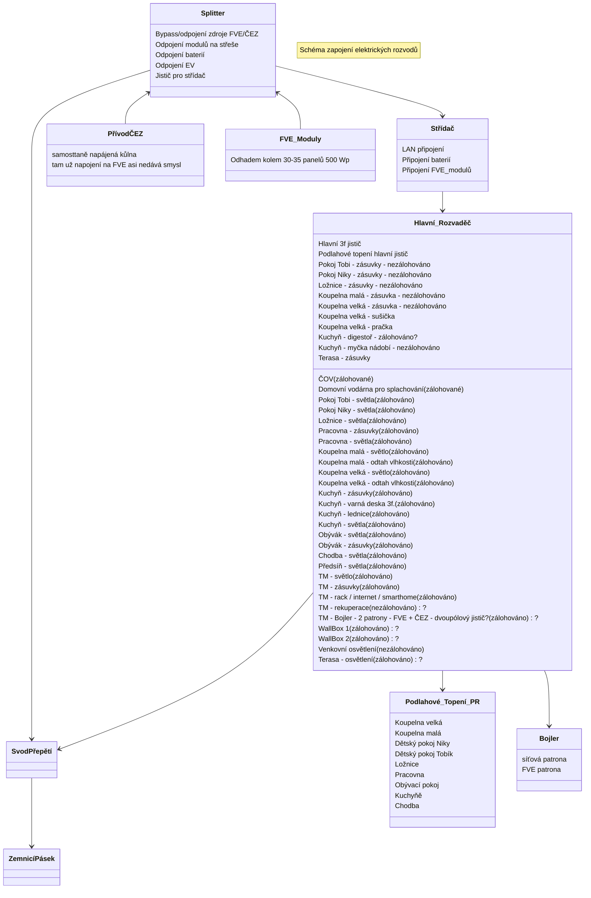

# Zapojení Elektřiny

## Požadavky:

- FVE a ČEZ je možné úplně oddělit (v případě poruchy zdroje X přepnout pouze na zdroj Y - bypass zdroje X)
- FVE funguje v hybridním 3f. režimu (může dodávat do sítě, ale nechceme)
- FVE může:
  - nahřívat bojler
  - dobíjet baterie (jde i ze sítě - dle spotu a výhodnosti - Loxone?)
  - dobíjet EV (jde i ze sítě - dle spotu a výhodnosti - Loxone?)
  - provozovat většinu domácnosti (primárně všechno asi krom podlahového vytápění)
- Bateriový systém + EV powerbanka (V2L a V2H)
  - napájí chod domácnosti (omezený rozsah)
    - světla
    - vybrané označené zásuvky
    - smart home / servery / internet
    - lednice
    - Domovní vodárna pro splachování
    - varná deska?
    - rekuperace?
    - ČOV?
  - vypomáhá FVE s vykrytím špiček na fázi (asymetrie střídače)?
  - může v budoucnu dodávat do sítě (není nutné, ani nevím zda žádané)
- Světla
  - rozmyslet, zda se spínají pomocí relé v TM a vypínače jsou pouze tlačítka s UTP/FTP, nebo vypínače na stěně.
  - LEDky třeba na 24V? Nemusely by jít přes střídač z baterií.
- Koupelny
  - zásuvky nezálohováno, ale možná můžeme spojit se světlem a není třeba vlastní jistič/chránič? V tom případě můžeme zálohovat včetně světel (stejně tam v 95 % nic nebude zapojeného)
- Pokoje dětí / ložnice
  - Stejně jako v koupelně, zda nezálohovat zásuvky stejně jako světla? Max tam bude notebook/tablet/mobil a stolní lampička...

## TZB:
- kamerový systém (vlastní na Synology)
- bezpečnostní systém (alarm, okna, má to vůbec smysl)?
- protipožární systém?
- moisture guarg ve stěnách?

