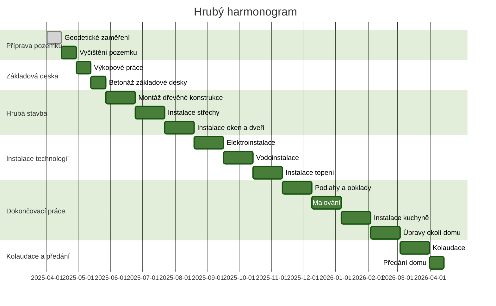
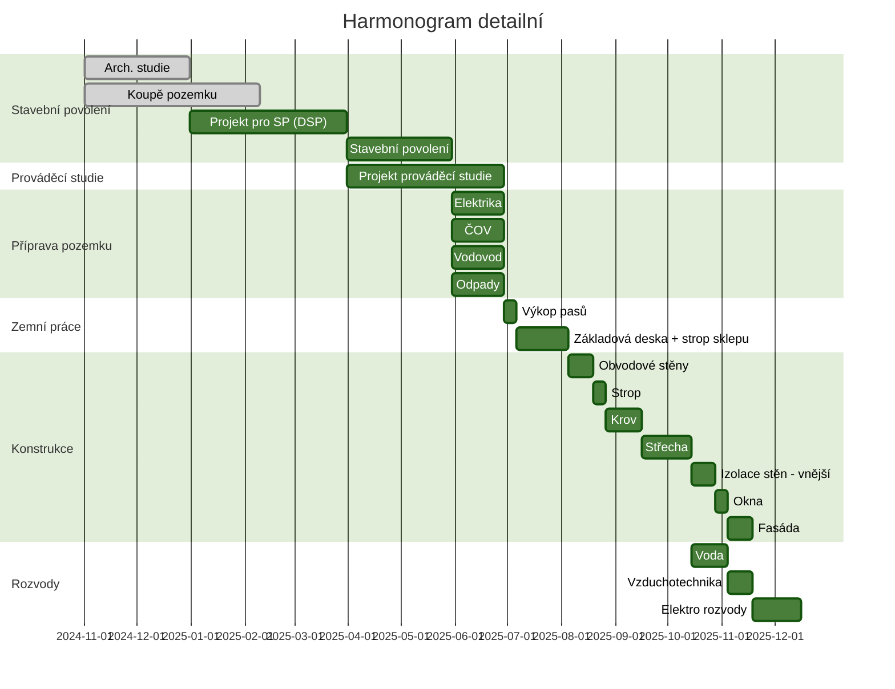

# Harmonogram

---

- zemní a výkopové práce (zemní a terénní úpravy, výkopy základů a základových spár, přemístění stržené ornice a uložení
  či odvoz hlušiny)
- budování základů domu (včetně hydroizolací a případné ochrany před zvýšeným radonovým rizikem a prostupů inženýrských
  sítí)
- hrubá spodní stavba (realizace svislých a vodorovných konstrukcí přízemí, vodorovné izolace a případně i zásypy a
  obsypy)
- realizace střechy (střešní konstrukce i krytina včetně doplňků, střechy se rovnou realizují kompletní s výjimkou
  odvádění vody, okapové systémy realizujeme až po případném vnějším zateplení a realizaci fasády)
- realizace nezděných nenosných příček a dalších konstrukcí (třeba sádrokartonové podhledy, příčky včetně osazení
  zárubněmi, …)
- realizace hrubých instalací (rozvody vody, kanalizace, elektřiny, plynu, vzduchotechniky, ústředního topení včetně
  podlahového vytápění – s ním souvisí i podkladové vrstvy podlah, …)
- realizace vnitřních omítek
- realizace podlah a obkladů
- vnitřní malířské a natěračské práce, nášlapné vrstvy podlah, kompletace instalací
- realizace fasády (případně i zateplení fasády a dokončovací klempířské práce – parapety, okapy, …)
- dokončovací práce (venkovní schodiště, chodníky, …)
- kontrola kvality a odevzdání stavby
- úprava terénu a realizace zahrady včetně oplocení včetně bran a branek (pokud nebylo oplocení realizováno již dříve)

---

- Příprava pozemku (Duben 2025)
    - Týden 1-2: Vyčištění pozemku, odstranění vegetace a starých staveb
    - Týden 3-4: Geodetické zaměření a příprava stavebního místa
- Základová deska (Květen 2025)
    - Týden 5-6: Výkopové práce a příprava základů
    - Týden 7-8: Betonáž základové desky
- Hrubá stavba (Červen - Říjen 2025)
    - Týden 9-12: Montáž dřevěné konstrukce (stěny, stropy)
    - Týden 13-16: Instalace střechy a krytiny
    - Týden 17-20: Instalace oken a dveří
    - Týden 21-24: Venkovní fasády
- Instalace technologií (Září - Listopad 2025)
    - Týden 21-24: Elektroinstalace a vodoinstalace
    - Týden 25-28: Instalace topení a rekuperace
    - Týden 29-32: Vnitřní omítky, podhledy
- Dokončovací práce (Prosinec 2025 - Březen 2026)
    - Týden 33-36: Podlahy a obklady
    - Týden 37-40: Malování a finální úpravy interiéru
    - Týden 41-44: Instalace kuchyně a koupelny
    - Týden 45-48: Úpravy okolí domu (stání, chodník, zarovnání terénu)
- Kolaudace a předání (Duben 2026)
    - Týden 49-52: Kolaudace a předání domu