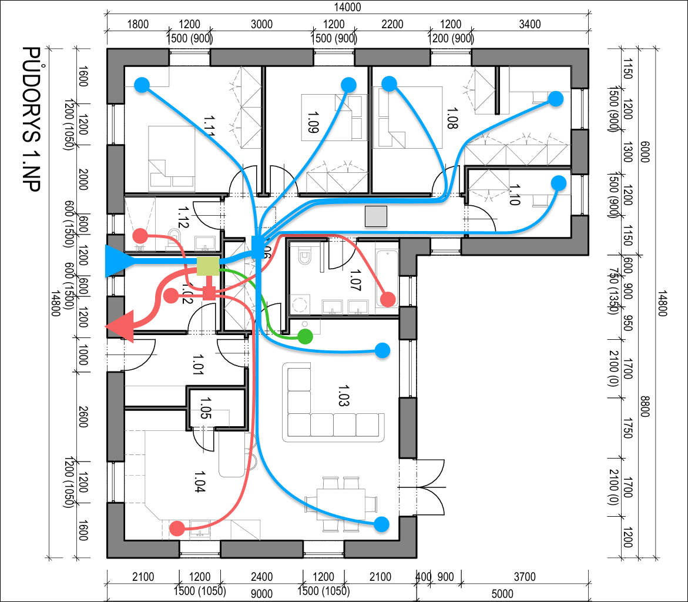

# Vytápění

V RD budeme mít 3 potenciální zdroje tepla. Podlahové/stropní elektrické vytápění, krb a rekuperaci.

## Podlahové

- Elektrické rohože těsně pod nášlapnou vrstvou.

#### Krytina:

[Detail k podlaze](./Podlaha.md)

- vybírejte podlahovou krytinu s tepelným odporem menším než 0,15 m2.K/W.
- Ideální krytinou je pro podlahové topení dlažba, má totiž vysokou míru tepelné vodivosti a bude tedy dobře předávat
  teplo. Vhodná je však i řada dalších materiálů, například laminátové a dřevěné krytiny nebo PVC
- Pokud se rozhodnete pro tuto (laminát, dřevěná), je důležité dodržovat maximální výkon topení 100 W/m2, aby
  nedocházelo k tepelné roztažnosti podlahy.

| Typ podlahové krytiny a pořadí vrstev konstrukce                                                                | tloušťka     | tepelná vodivost | odpor kladený vedení tepla  | tloušťka celé konstrukce |
|-----------------------------------------------------------------------------------------------------------------|--------------|------------------|-----------------------------|--------------------------|
|                                                                                                                 | D            | λ                | R λ B                       | dWD                      |
| jednotky                                                                                                        | mm           | W/mK             | m2 K/W                      | mm                       |
| Textilní podlahová krytina                                                                                      | 10           | 0,07             | max 0,15                    | 10                       |
| Parkety Lepící hmota Celkový tepelný odpor konstrukce                                                     | 8 2       | 0,2 0,2       | 0,04 0,01 0,05        | 10                       |
| Plastová podlahová krytina např\.PVC                                                                            | 5            | 0,23             | 0,022                       | 5                        |
| Novilon Nova                                                                                                    | 3,2          | 0,25             | 0,0352                      | 3,2                      |
| Novilon Viva                                                                                                    | 2,4          | 0,25             | 0,0264                      | 2,4                      |
| Novilon Prima                                                                                                   | 2,0          | 0,25             | 0,0264                      | 2,0                      |
| Novilux Structura                                                                                               | 2,2          | 0,25             | 0,022                       | 2,2                      |
| Novilux Trafic                                                                                                  | 3,0          | 0,25             | 0,03                        | 3,0                      |
| Marmoleum                                                                                                       | 9,8          | 0,17 0,25     | 0,037                       |                          |
| Keramická dlažba Tenké maltové lože Celkový tepelný odpor konstrukce                                      | 10 2      | 1 1,4         | 0,01 0,001 0,011      | 12                       |
| Keramická dlažba Maltové lože Celkový tepelný odpor konstrukce                                            | 10 10     | 1 1,4         | 0,01 0,007 0,017      | 20                       |
| Korková podlaha                                                                                                 | 10,5         |                  | 0,114                       |                          |
| Desky přírodního nebo umělého kamene v tomto případě mramor Maltové lože Celkový tepelný odpor konstrukce | 15  10 | 3,5  1,4   | 0,004  0,007 0,011 | 25                       |
|                                                                                                                 |              |                  |                             |                          |

## Rekuperace

[Předpokládaný návrh zapojení rekuperace. (Figma projekt)](https://www.figma.com/design/HXPyJgDuI7QUvlEugycx2D/Vzduchotchnika?node-id=0-1&t=dSRtvnLBsCDfXFPA-1)

Je potřeba počítat, že odtah rekuperace bude muset být na střechu nebo veden podhledem někam ke kuchyni aby splnil odstup přívodu/výfuku od sebe.

E-shopy:

- [rekuperacka.cz](https://www.rekuperacka.cz/)
- [termikoneshop.cz](https://www.termikoneshop.cz/) - nabízí [odkud přebytečného materiálu](https://www.termikoneshop.cz/prebytecny-material--nevadi/)!

### Požadavky

- Klapky na jednotlivé místnosti (možnost uzavřít pracovnu + obývák a nechat profukovat pouze ložnice v noci)
- naboostovat samostatně wc, koupelnu, digestoř / jednotlivé pokoje pro "přitopení"
- samostatný přícuc tepla od krbových kamen (nemusí jít nutně přes rekuperák, ale klidně napřímo do místností? Výhoda
  asi víc tepla, nevýhoda možného přenosu smradu?)
- sběrnice modbus nebo ideálně vlastní API a LAN konektor / loxone integrace
- tichá
- možnost trošku víc chladit / topit
- nesmí zamrzat (předehřev)
- uhlíkový filtr / filtr mikročástic - Brink Pure Induct před jakoukoliv reku? Dávalo by smysl?

[Jak vybrat komponenty pro rozvody vzduchu](https://www.termikoneshop.cz/kompletni-navod--jak-vybrat-komponenty-pro-rozvody-vzduchu/)

### Nice to have

- možnost napojit na chlazení / ohřev (vzduch-vzduch, musí být příprava z TM ven na tepelko!)

### Modely

#### [Atrea Duplex 360 Pro-V - SVT33621](https://atrea.eu/cs/vyrobky/duplex-pro-pro-v/) (56 000 Kč)

#### [Atrea Rx5](https://atrea.eu/cs/vyrobky/duplex-r5/) (105 000 Kč)

- [technický list](https://atrea.eu/_files/documents/253_LgLEGA5F.pdf)
- rozvody čistého vzduchu 200mm, špinavého 160mm
- modbus TCP, webserver s XML se všemi daty
- napojení na loxone přes modbus
  a [vodníci konfigy](https://www.vodnici.net/community/diy-navody-loxone-arduino/riadenie-rekuperacie-atrea-z-loxone/paged/2/)
- Přístup do servisního menu (Odkaz na servisni menu je na strance uzivatelskeho menu vpravo dole.) je tří místné a je
  to číslo dne v týdnu, číslo zítra a číslo pozítří. Např. v úterý je to 234, v pátek je to 567, v neděli je to 712, ...
  ....tak už jsem na to přišel....ono totiž heslo nejde zadat v microsoft edge a to na PC ani na mobilu...čili budete-li
  mít někdo stejný problém jako já, použijte chrome
- [čtení dat z XML](https://forum.tzb-info.cz/133605-atrea-data-logging-monitoring-cez-webserver)
- [Ofiko Loxone modul](https://library.loxone.com/detail/atrea-rd5-1295/overview)
- [Home Assistant integrace](https://github.com/JurajNyiri/HomeAssistant-Atrea)

#### [Zehnder ComfoAir Q350 TR](https://www.zehnder-rekuperace.cz/zehnder-comfoair-q350-tr/) (108 263 Kč)

#### [Brink Flair 325](https://www.storc.cz/cs/produkt/flair-325400) 90 000 Kč

#### [Brink Renovent Sky 350](https://www.storc.cz/cs/produkt/renovent-sky-300) 65 000 Kč

#### [Nilan Comfort 350 TOP Polar](https://nilan.cz/comfort-350-top/) (72 500 Kč)

- [technický list](https://nilan.cz/wp-content/uploads/2023/05/Comfort-350-Top-Produktovy-list.pdf)

#### [Nilan VPL 10 TOP](https://nilan.cz/vpl-15-top/) (99 500 Kč)

Aktivní rekuperace (používá tepelné čerpadlo), takže vlastně už ani není moc standardní reku, jak ji známe, jako spíš malé samotné tepelko vzduch/vzduch.

- [technický list](https://nilan.cz/wp-content/uploads/2023/03/PL2303_VPL-15-TOP.pdf)

#### [Regulus Sentinel Advance SX](https://www.regulus.cz/cz/rekuperacni-jednotka-sentinel-advance-sx-svt-9238) (105 754 Kč)

### Finální výběr

#### Jednotka

Rekuperační jednotka od [Atrea Ra5](https://atrea.eu/cs/vyrobky/duplex-r5/) zvolena jako asi nejlepší možná volba s přihlédnutím na:

- pořizovací cenu
- pravidelné náklady (filtry)
- možnost sehnat někoho na servis / údržbu
- poměr cena/výkon/hlučnost

#### Rozvody

- [Kulaté 90mm](https://www.termikoneshop.cz/90mm-system-potrubi/) (ploché [Zehnder 51mm](https://www.termikoneshop.cz/ploche-potrubi/) jsou zbytečně drahé, blbě se budou čistit)
- koncovky Zehnder ComfoValve Luna S125 (přívod) / Luna E125 (odvod) nebo jiné kvalitní co nebudou "ofukovat" pod výustkem

## Krbová kamna (kachlová)

- nezapomenout na nezávislý přívod vzduchu!!!

Nejspíš [Hass+Sohn Treviso Mini](https://www.haassohn-rukov.cz/produkty/krbova-kamna/04343-kachlova-kamna-treviso-mini) / [Loreto](https://www.haassohn-rukov.cz/produkty/archiv/krbova-kamna/03314-1-kachlova-kamna-loreto) / [Laguno](https://www.haassohn-rukov.cz/produkty/archiv/krbova-kamna/03314-kachlova-kamna-lugano)

Něco jako

## Elektrické žebříky

- Elektrické žebříky / přímotopy v koupelnách na ručníky
- sušák na boty v TM