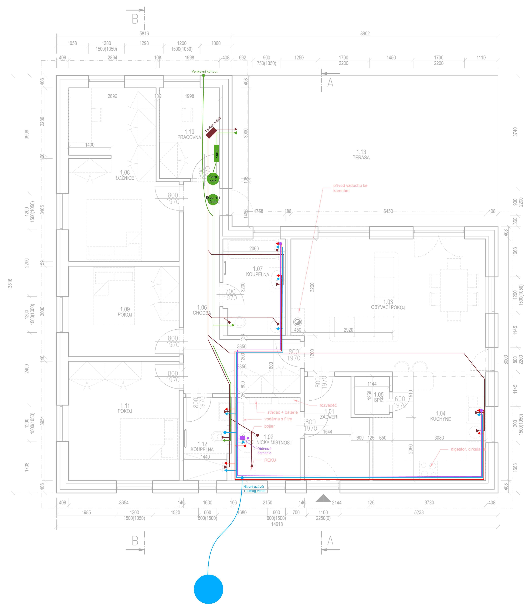

# Zapojení vody a odpadu
Vodovod je napojen na vodovodní obecní řad zakončen ve vodoměrné šachtě. Není součástí SČVK.

Odpad je sveden do lokální ČOV na pozemku a dále přepadem odvedeno přes obecní kanalizaci do toku.

Na pozemku je sbírána dešťová voda do podzemní akumulační nádrže (4-6 m3 +-?) s přepadem do vsaku a nouzovým přepadem do toku.

## Rozvody návrh [(Figma)](https://www.figma.com/design/HXPyJgDuI7QUvlEugycx2D/RD-Smr%C4%8D%C3%AD?node-id=7-4&t=4kytI06Ece1r3PdN-1)

## Požadavky voda:
- Vodovod zaveden do TM
  - ideálně do vodoměrné šachty udělat elektronické odpojování při úniku vody? Nebude to ale s celou vodomědnou šachtou náhodou pod vodou? :D
- V TM je bojler (asi [Dražice OKCE 500 S](https://www.dzd.cz/ohrivace-a-zasobniky-teple-vody/elektricke/stacionarni/okce-s)), nahříván ze sítě a FVE, o kapacitě alespoň 300l se dvěmi patronami
- Z TM je rozvod studené vody do:
  - koupeny malé (umyvadlo, sprchový kout, bidetová sprška)
  - koupelny velké (umyvadla, vana, pračka)
  - kuchyně (dřez, ~~myčka~~ (bude napojena pouze na teplou)
  - na terasu (doplnění vody do akumulační nádrže pro WC v případě dlouhého sucha)
- Z TM je rozvod teplé vody z Bojleru do:
  - koupelny malé (umyvadlo, sprchový kout)
  - koupelny velké (umavadlo, vana)
  - koupelna velká a kuchyně má [recirkulační obvod](https://chytrydumsvepomoci.cz/blog/cirkulace-teple-vody) aby byla neustále dostupná teplá voda 
  - kuchyně (myčka, dřez)
- Z TM/sklepu je rozvod užitkové (dešťové) vody do:
  - koupelny malé (WC)
  - koupelny velké (WC)
  - na terasu (zálivka / mytí auta)? Nebude lepší natáhnout rovnou z akumulační nádrže?

## Požadavky odpad:
- odpad má odvětrání na střechu (společný se spojením v půdním prostoru? - co nejméně prostupek střechou)
- samostatné odvětrávání ČOV, je to potřeba, nebo projde společným odvětráváním v baráku nad střechu?
- odpad je z:
  - Koupelna malá
    - sprchový kout
    - umyvadlo
    - WC
  - Koupelna velká
    - vana
    - umyvadlo
    - pračka
    - sušička
    - WC
  - Kuchyň
    - dřez
    - myčka
  - TM
    - kondenzát z rekuperace
    - nouzové vypuštění bojleru
    - odtok na podlaze pro případ havárie? Aby nevyplavilo všechnu elektroniku, nebude smrdět zbytečně, počítám, že sifon by vyschnul brzo?
